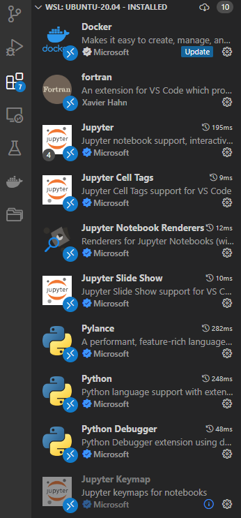
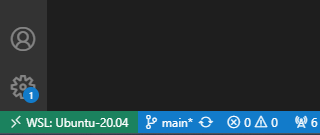
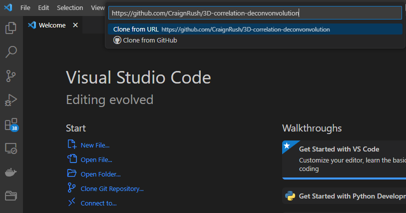
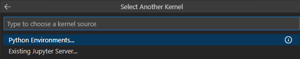
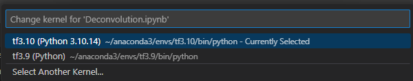

# 3D-correlation-deconvonvolution
This is a lightweight repository (with the _awesome_ code of https://github.com/hammerlab/flowdec/) for the deconvolution of a Leica *.lif file comprised of individual multichannel stacks per FOV. It was built for the 2024 EMBO "In situ structural biology by Cryo-FIB and Cryo-ET". However, this code should be freely adaptable to deconvolve any image stack in the (c)zyx format if the microscope parameters for PSF generation are known. 
If you would like to use different formats or have questions, please don't hesitate to reach out to jbrenner@biochem.mpg.de.

PS: Actually, this code could be improved by using only its PSF-generation capabilities and then the deconvolution of cucim.skimage.restoration.richardson_lucy()! However, I never had time to go down that rabbit hole...

# Running deconvolution
To run a deconvolution there are two options: you can use a) the [runner.py](runner.py) script to run a batch deconvolution or b) the [Deconvolution.ipynb](Deconvolution.ipynb) to test single stacks in an ipython notebook environment. Also there is a [plotting_notebook](plotting_notebook.ipynb) for displaying stack in various manners.
For the runner.py notebook, only the `file_pattern` and `output_folder` paths have to be set. Please be aware that the running script only works for *.lif files currently.

## Running the scripts on the MPI for Biochemistry visualization cluster
In order to execute the runner.py script on a graphics card cluster of the MPI, we only need to login, load the module and execute the runner. For external users, please refer to the [miniconda installation section](#installation-of-the-conda-environment)

```sh
# Log into a gpu cluster
ssh hpcl9301

# Move to a directory where you want to execute the code from

git clone https://github.com/CraignRush/3D-correlation-deconvonvolution

# Reserve a node and open a bash with the at least one gpu 
srun --nodes=1  --partition=p.hpcl93 --ntasks-per-node=1  --gres=gpu:4  --time=01:00:00 --pty bash -i

# Load the module FLOWDEC
module load FLOWDEC

#sanity check the used python version
which python 
#   --> should yield /fs/pool/pool-bmapps/hpcl8/app/soft/FLOWDEC/12-04-2024/conda3/envs/flowdec/bin/python

# Create an output folder
mkdir <put your folder path here>

#
# Insert the correct paths to your lif and output folder in the runner.py script
#

# Start the execution with:
python runner.py
```


# Installation
The GPU-accellerated installation has been carried out on [Windows 11 machines using the Windows Subsystem for Linux 2 (WSL2)](#installation-on-a-windows-10-or-higher-machine) and [linux machines](#installation-on-linux), please refer to the appropriate subsections.

The most complicated part is probably the installation of GPU-supported tensorflow. Installing it from the conda environment with ```conda install conda-forge::tensorflow``` proved as the easiest solution. However, this will only work if an appropriate toolchain of CUDA drivers is installed. (For more details look into https://www.tensorflow.org/install/pip). A more detailed explanation can also be found in the Windows tutorial.

Once you installed all drivers, you should proceed with installing miniconda and the conda setup file [environment.yml](environment.yml) from this repo. This could in principle work already with any toolchain but one might have to adjust the tensorflow[and-cuda] 


## Installation on linux
For linux machines, it should be straight forward by installing the Nvidia drivers (same link as for winows below) and installing ```pip install tensorflow[and-cuda]```

## Installation on a windows 10 (or higher) machine
This is not the typical installation required for tensorflow as here: https://www.tensorflow.org/install/pip. However, these tutorials didn't work for me properly (and according to the number of stackoverflow articles a bunch of others...)

1. #### Install the recent Nvidia drivers
   https://www.nvidia.com/Download/index.aspx?lang=en-us
   
1. #### Install the WSL2 environment (if you don't have already)
   Open a powershell as administrator and execute

    ```sh
    wsl --install ##Install WSL
    wsl --update # Ensure that you have the latest kernel
    wsl -l -v # Check that WSL2 is used! if not: wsl --set-version <Distro> <Version>
   ```
    This command will enable the features necessary to run WSL and install the Ubuntu distribution of Linux.
   
1. #### Install the current Nvidia CUDA drivers in the WSL
   Go into WSL2 by executing this in a powershell or terminal
   ```sh
   wsl
   ```
   Then download and install the latests toolkits
   (reference: https://developer.nvidia.com/cuda-downloads?target_os=Linux&target_arch=x86_64&Distribution=WSL-Ubuntu&target_version=2.0&target_type=deb_local)
    ```sh
     wget https://developer.download.nvidia.com/compute/cuda/repos/wsl-ubuntu/x86_64/cuda-wsl-ubuntu.pin
     sudo mv cuda-wsl-ubuntu.pin /etc/apt/preferences.d/cuda-repository-pin-600
     wget https://developer.download.nvidia.com/compute/cuda/12.4.0/local_installers/cuda-repo-wsl-ubuntu-12-4-local_12.4.0-1_amd64.deb
     sudo dpkg -i cuda-repo-wsl-ubuntu-12-4-local_12.4.0-1_amd64.deb
     sudo cp /var/cuda-repo-wsl-ubuntu-12-4-local/cuda-*-keyring.gpg /usr/share/keyrings/
     sudo apt-get update
     sudo apt-get -y install cuda-toolkit-12-4
   ```
   Check whether the drivers have been successfully installed:
   ```sh
   nvidia-smi
   ```
1. #### Create a suitable conda enviromment and test if it uses the graphics card properly
   (reference: https://medium.com/@MemoonaTahira/installing-tensorflow-with-gpu-support-on-windows-wsl-in-2022-a9c4a064678b)

   First, install Miniconda in the WSL
   ```sh
    curl https://repo.anaconda.com/miniconda/Miniconda3-latest-Linux-x86_64.sh -o Miniconda3-latest-Linux-x86_64.sh
    bash Miniconda3-latest-Linux-x86_64.sh
    source ~/.bashrc
   ```
    Create and activate a conda environment with python 3.10 (or the last supported TensorFlow version)
   ```sh
    conda create -n tf3.10 python=3.10 -y
    conda activate tf3.10
   ```
    install cudatoolkit and cudnn (there is no need to specify their versions, these will be downloaded based on you current nvidia driver, but if you run into trouble, you can use versions specified in the TensorFlow guide):

   ```sh
    conda install -c conda-forge cudatoolkit cudnn
   ```

   After a successful installation, add cudatoolkit and cudnn to path permanently:
   ```sh
    mkdir -p $CONDA_PREFIX/etc/conda/activate.d
    echo 'export LD_LIBRARY_PATH=$LD_LIBRARY_PATH:$CONDA_PREFIX/lib/' > $CONDA_PREFIX/etc/conda/activate.d/env_vars.sh
   ```
   
   Install pip inside conda:
   ```sh
    conda install pip
    # Confirm pip is coming from conda:
    which pip
    pip --version
   ```

    This way conda will use its own pip instead of the Ubuntu system pip inside an enabled conda environment. Any package installed via pip when a conda environment is enabled will remain isolated within that environment and won't be visible globally, which is the main point of using a virtual environment like conda. 
   ```sh
    # install tensorflow
    pip install tensorflow
    
    # Verify the install uses GPU (this command should return a list of GPU devices):
    python3 -c "import tensorflow as tf; print(tf.config.list_physical_devices('GPU'))"
     ```
## Adding external files or network drives
   In case your data is stored on an external drive that i not mounted per default into WSL, we have to add it first.
   ```sh
   sudo mount -t drvfs <INPUT FOLDER> /mnt/<FOLDER IN WSL2>
   #Example: sudo mount -t drvfs '//samba-pool-pool-plitzko3.biochem.mpg.de/pool-plitzko3' /mnt/plitzko3   
   ```

   CAVEAT: If you execute this command in the WSL, the drive has to be remounted every time you restart. To make it persistent, add the command from above to the very end of your ```~/.bashrc``` file.
   ```sh
   sudo nano ~/.bashrc
   #put your sudo mount -t drvfs <INPUT FOLDER> /mnt/<FOLDER IN WSL2> at the very end
   source ~/.bashrc #to reload your .bashrc
   ```

   ### If that worked, great, you now can work on your GPU! :D

   ### But we still need a code editor to run our scripts:

## Installing VS Code support
   1. ##### Install VS Code as usual on your windows machine
   1. ##### Add the extensions "Jupyter" and "Python" (both from microsoft)
   
   1. ##### Click onto the green button in the bottom left corner and connect to the WSL
   
   1. ##### Now you can clone this repository and save it into a desired location
   
   1. ##### Open the scipt _Deconvolution.ipynb_ and select the previously created _tf3.10_ kernel
   
   